# Packet Tracer .pkt

Packet Tracer file is available for download. 

----- July 2026 -----
# SpenTech Enterprise Network

## Overview

This project simulates the network infrastructure for a fictional company called **SpenTech**. My goal was to design and secure an enterprise network while applying the networking concepts I've learned, including VLANs, routing, network services, and security best practices.

The network is organized into separate departments and includes services such as DHCP, DNS, and an internal web server. Throughout the project, I focused not only on making the network functional but also on designing it the way it would be implemented in a real business environment.

---

# Technologies Used

- Cisco Packet Tracer
- Cisco IOS
- VLANs
- Router-on-a-Stick
- Inter-VLAN Routing
- DHCP
- DNS
- SSH
- Access Control Lists (ACLs)
- Port Security
- PortFast
- BPDU Guard
- Spanning Tree Protocol (STP)

---

# Enterprise Topology

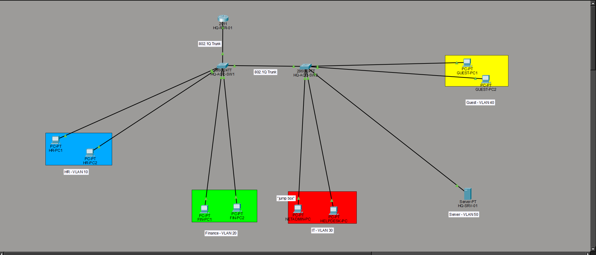

This is the overall layout of the SpenTech enterprise network. The network is divided into separate departments including HR, Finance, IT, Guest, Servers, and Management. Two switches connect the departments while a router provides communication between VLANs.

---

# VLAN Configuration

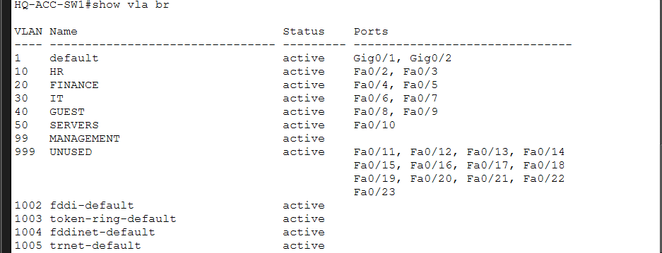

Each department has its own VLAN to separate network traffic and improve both security and performance. This design reduces broadcast traffic and allows access between departments to be controlled through routing and security policies.

---

# Trunk Links

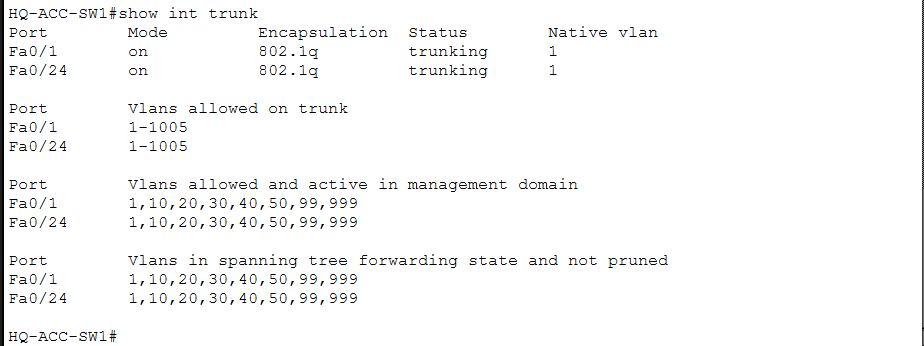

Trunk ports carry traffic for multiple VLANs between the router and switches using 802.1Q tagging. This allows multiple networks to share a single physical connection while remaining logically separated.

---

# Router Subinterfaces

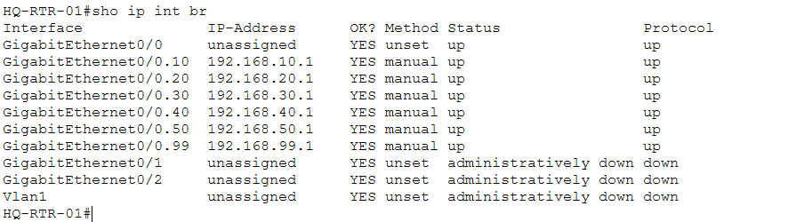

The router uses subinterfaces to provide a default gateway for every VLAN. This configuration allows devices in different departments to communicate when permitted while maintaining separate networks.

---

# Routing Table

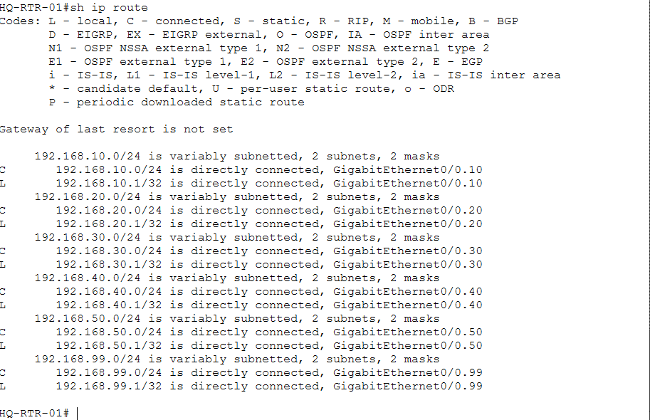

The routing table shows each VLAN network that the router knows about. Since every department has its own subnet, the router is responsible for directing traffic between them.

---

# Secure Remote Management (SSH)

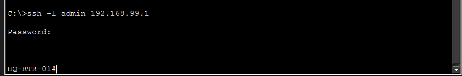

SSH allows secure remote management of the network devices using encrypted communication. This is much more secure than Telnet because usernames and passwords are never sent in plain text.

---

# Dedicated Management Workstation

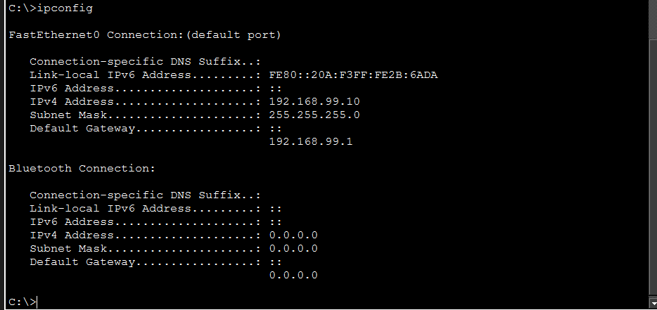

A dedicated NETADMIN-PC was created on the Management VLAN with a static IP address. Only this workstation is allowed to remotely manage the network devices through SSH.

---

# Access Control Lists (ACLs)

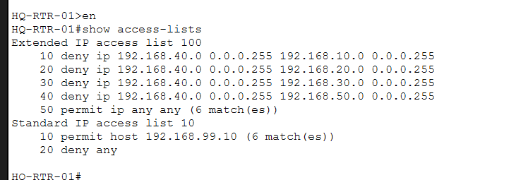

Access Control Lists improve security by controlling which devices are allowed to communicate. In this network, Guest devices are prevented from accessing internal departments, while only the NETADMIN-PC is allowed to remotely manage the router.

---

# Port Security

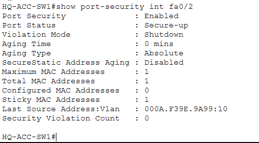

Port Security restricts each access port to a single approved device. If an unauthorized device is connected, the switch can automatically disable the port to prevent unauthorized access.

---

# Layer 2 Security

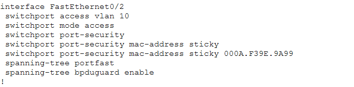

Each access port is configured with several security features including Port Security, PortFast, and BPDU Guard. These features help secure the switching environment while allowing trusted devices to connect quickly.

---

# DHCP Configuration

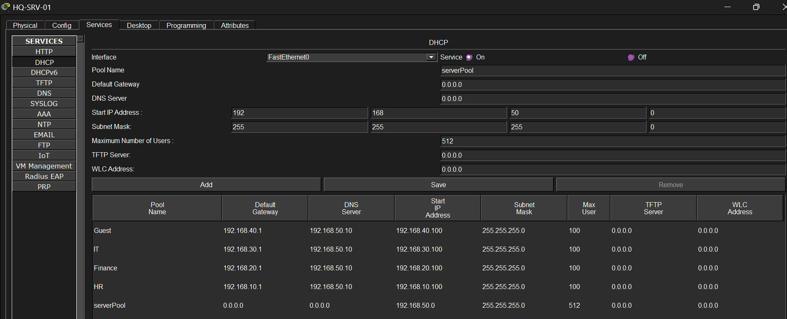

The DHCP server automatically assigns IP addresses, default gateways, and DNS information to devices throughout the network. This removes the need to manually configure every workstation.

---

# DNS Configuration

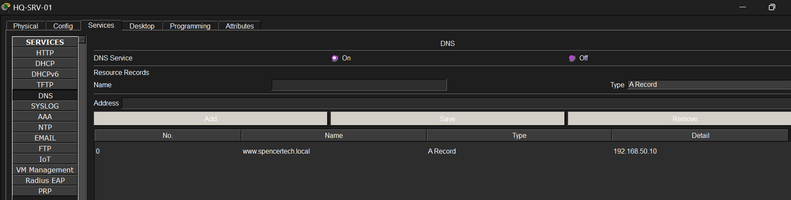

The DNS server allows devices to locate resources by name instead of remembering IP addresses. This makes internal services easier for users to access.

---

# Internal Company Website

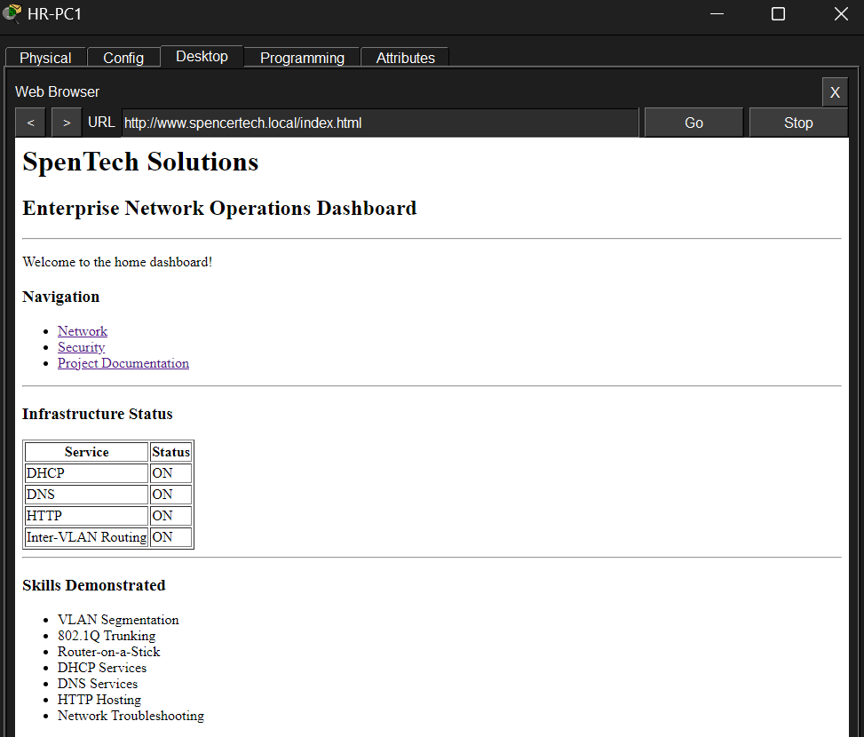

An internal web server demonstrates basic enterprise network services. After routing, DNS, and DHCP are configured correctly, users can successfully access the company website across the network.

---

# Security Features Implemented

- VLAN Segmentation
- Router-on-a-Stick Inter-VLAN Routing
- Dedicated Management VLAN
- Secure SSH Management
- Standard and Extended ACLs
- Port Security with Sticky MAC Addresses
- Disabled Unused Switch Ports
- "Black Hole" VLAN (VLAN 999)
- PortFast
- BPDU Guard
- Centralized DHCP
- Centralized DNS

---

# Current Status

### Completed

- Enterprise network topology
- VLAN implementation
- Inter-VLAN routing
- DHCP
- DNS
- Internal web server
- SSH configuration
- Access Control Lists
- Port Security
- Management VLAN
- PortFast
- BPDU Guard

### Planned Enhancements

- DHCP Snooping
- Dynamic ARP Inspection (if supported)
- EtherChannel
- VoIP
- Windows Server Integration
- Active Directory
- Group Policy
- Network Automation with PowerShell/Python

